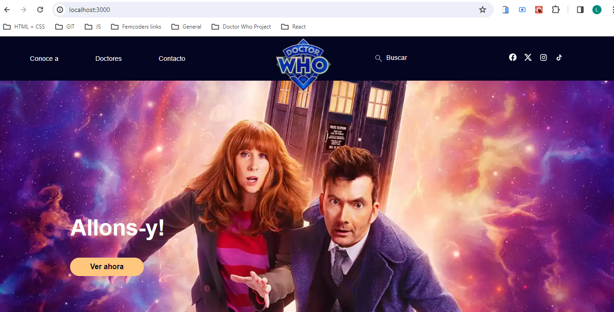
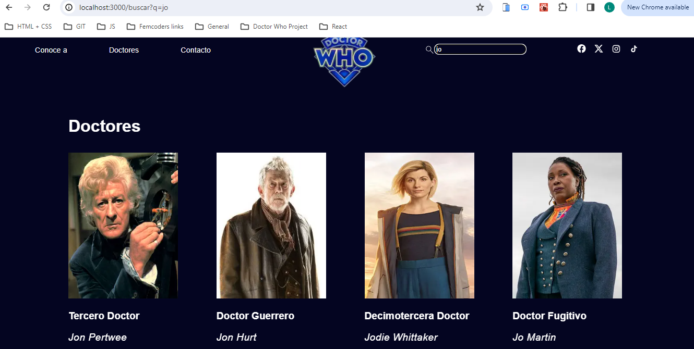
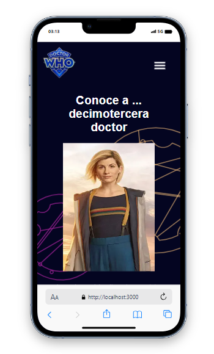
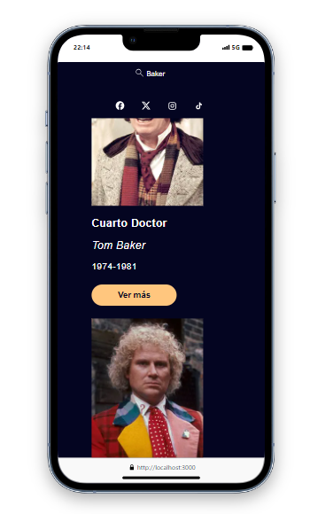

# DOCTOR WHO PROJECT 

Solo project involving the creation of a Spanish-language website for the classic BBC series 'Doctor Who'. 

## Table of Contents

- [Images](#images)
- [Description](#description)
- [Technologies](#technologies)
- [Testing](#testing)

## Images

## Description

This project involved the creation of multiple-page responsive website in React with Next.js. The site design, as specified by the fictional client via a detailed Figma mock-up, features various unique elements and pages. These include a page featuring cards for all the actors to have featured in the series, a search function for these actors by name, a working contact form, and a hamburger menu in the mobile version. 

## Technologies

- Visual Studio Code 
- CSS Modules 
- React v. 18
- Next.js v. 14.0.4
- Node.js v20.9.0
- Vitest v. 1.1.3

## Testing

Testing involved verifying the the correct rendering of the Button component and the existence of a message area in the contact form. All tests passed. To perform these same tests, it is necessary to install Node.js and follow the Next.js guidelines for using Vitest with this React framework.    
   
## Planning
https://trello.com/invite/b/X8SrVrOD/ATTI489989296423fae03dd52feb7d9da552E30E44AE/doctor-who-project 

## Presentation
https://www.canva.com/design/DAF3tUeW-K4/lC3uEN9X6aZ8lJBeYNSJTQ/edit?utm_content=DAF3tUeW-K4&utm_campaign=designshare&utm_medium=link2&utm_source=sharebutton

---

Back to: [Table of Contents](#table-of-contents)

